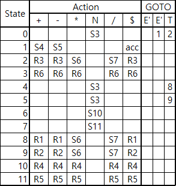
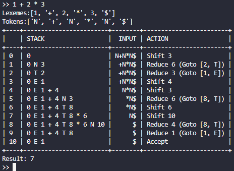
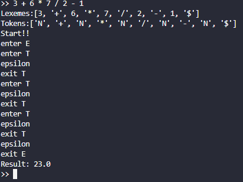

# Implementing of Parsing Algorithm

<!-- 
## Environment
- OS : Ubuntu 22.04.4 LTS (WSL2)
- Python 3.10.12

## File structure
```sh
syntaxAnalyzer
    ├── LLParser.py
    ├── LRParser.py
    ├── Lexer.py
    ├── SyntaxAnalyzer.py
    ├── Table.py
    └── test.py
```
- `LLParser.py` : Parser using LL Parsing Algorithm
- `LRParser.py` : Parser using LR Parsing Algorithm
- `Lexer.py` : Lexical Analyzer
- `SyntaxAnalyzer.py` : Main program (with Lexer and Parser)
- `Table.py` : Table for printing process of LR Parser (not a parsing table!)
- `test.py` : Test program
-->

## 0. Parsing Table


## 1. Lexical Analyzer
- Implemented in `lexer.py'
  - number : `N`
  - operator : `+`, `-`, `*`, `/`
  - end of input : `$`
  - other : `unknown`
- Result of Lexical Analyzer is in 2 and 3.

## 2. Shift-Reduce Algorithm
- Implemented in `LRParser.py`, and set variable `SA` in `SyntaxAnalyzer.py` to `LRParser`.

### Result


## 3. Recursive Descent Parsing
- Implemented in `LLParser.py`
- Using EBNF Grammer
```ebnf
E ::= T { + T | - T }
T ::= N { * N | / N }
N ::= number        
```
- Set variable `SA` in `SyntaxAnalyzer.py` to `LLParser` to use this algorithm.

### Result


## 4. Test
- Test program is in `test.py`
  - Test for Lexical Analyzer : run, empty input, single input, random input, invalid input
  - Test for LL Parser : run, empty input, single input, zero division, random input, invalid input
  - Test for LR Parser : same as LL Parser
  - Test for both Parser : compare the result of LL and LR Parser